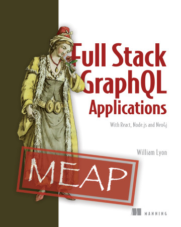

# Full Stack GraphQL Applications

This is the companion repository to the book [*Full Stack GraphQL Applications With React, Node.js, and Neo4j*](https://www.manning.com/books/fullstack-graphql-applications) written by [William Lyon](https://twitter.com/lyonwj) and published by Manning. Here you can find the [code](code/) to accompany each chapter as well as the [exercises and solutions](fullstack-graphql-book/tree/main/exercises) from each chapter.

## Table of Contents

* **1: What Is Full Stack GraphQL?** ([Exercises](exercises/chapter1))
* **2: Graph Thinking With GraphQL** (Code, Exercises)
* **3: Graphs In The Database** (Code, Exercises)
* **4: The Neo4j GraphQL Library** (Code, Exercises)
* **5: Building User Interfaces With React** (Code, Exercises)
* **6: Client Side GraphQL With React & Apollo Client** (Code, Exercises)
* **7: Adding Authorization & Authentication** (Code, Exercises)
* **8: Deploying Our Full Stack GraphQL Application** (Code, Exercises)
* **9: Advanced GraphQL Considerations** (Code, Exercises)
